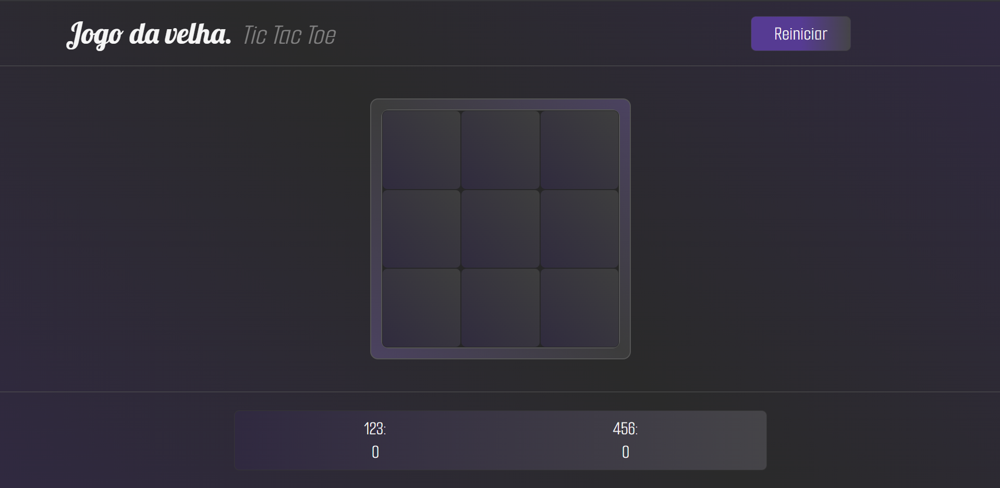

# 🎮 Jogo da Velha — Tic Tac Toe


> Projeto desenvolvido como parte do curso **The Odin Project**, com foco em organização de código JavaScript usando **Factory Functions** e **IIFE (Module Pattern)**.

---

## 📋 Sobre o Projeto

Um Jogo da Velha completo, jogável no navegador, com interface elegante, responsiva e animada. O projeto foi construído com ênfase em boas práticas de organização de código, mantendo o mínimo de variáveis no escopo global.



---

## ✨ Funcionalidades

- 🎯 **Lógica completa** — verificação de vitória em todas as combinações e detecção de empate
- 👥 **Dois jogadores** — cada um com nome personalizado inserido antes do jogo começar
- 🏆 **Placar persistente** — pontuação acumulada entre rodadas sem precisar reiniciar o jogo
- ⏱️ **Contagem regressiva** — após vitória ou empate, uma contagem de 3 segundos reinicia a rodada automaticamente
- 🎨 **Animação de resultado** — mensagem de vitória/empate sobe do placar com transição suave
- 🔄 **Botão Reiniciar** — reseta o jogo completo, incluindo o placar
- 📱 **Design responsivo** — adaptado para dispositivos móveis com media queries

---

## 🧠 Conceitos Aplicados

### Factory Functions
Funções que retornam objetos, usadas para criar os jogadores:
```javascript
function createPlayer(name, marca, idPontuacao) {
  return {
    name,
    marca,
    pontuacao: 0,
    idPontuacao,
  };
}
```

### IIFE — Module Pattern
Módulos que se executam imediatamente, com variáveis privadas e métodos expostos pelo `return`:
- **Gameboard** — gerencia o estado do tabuleiro
- **displayController** — controla toda a interação com o DOM
- **fluxoDoJogo** — controla a lógica e o fluxo da partida

---

## 🗂️ Estrutura do Código

```
├── index.html       # Estrutura da página
├── style.css        # Estilos principais
├── mobile.css       # Media queries para mobile
└── script.js        # Lógica do jogo
    ├── createPlayer()       # Factory de jogadores
    ├── Gameboard            # IIFE — tabuleiro
    ├── displayController    # IIFE — DOM e interface
    └── fluxoDoJogo          # IIFE — lógica do jogo
```

---

## 🎨 Design

- Paleta escura com gradientes em roxo e cinza
- Fontes **Lobster** e **Smooch Sans** do Google Fonts
- Efeitos de hover e active nos slots
- Modal com fundo embaçado (backdrop-filter blur)
- Animação de mensagem de vitória com `transition` CSS
- Layout construído com CSS Grid e Flexbox

---

## 🚀 Como Jogar

1. Abra o `index.html` no navegador
2. Insira os nomes dos jogadores no modal inicial
3. Clique em **Iniciar**
4. Clique nos slots para fazer sua jogada
5. O jogo detecta vitória ou empate automaticamente
6. Após 3 segundos, uma nova rodada começa
7. Use o botão **Reiniciar** para zerar o placar e começar do zero

---

## 📱 Responsividade

O layout foi adaptado para telas menores com media queries, ajustando:
- Tamanho dos slots do tabuleiro
- Layout do header (botão abaixo do título)
- Modal de entrada de nomes
- Mensagem de vitória em formato coluna

---

## 🔗 Links

- [The Odin Project](https://www.theodinproject.com/)

---

Desenvolvido com 💜 durante o curso The Odin Project.
